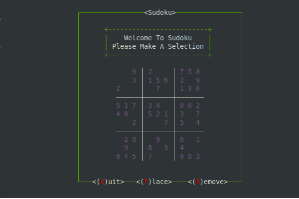

# C-udoku: A C++ Sudoku Game

A Simple game of sudoku written in C++, using the nCurses graphics library.

## Description
    A game of sudoku I made to start teaching myself C++. I used the nCurses library for its ease of use and because I think the ASCII style is cool. Everytime the program is run, it generates a random sudoku board with at least one solution. 

  

